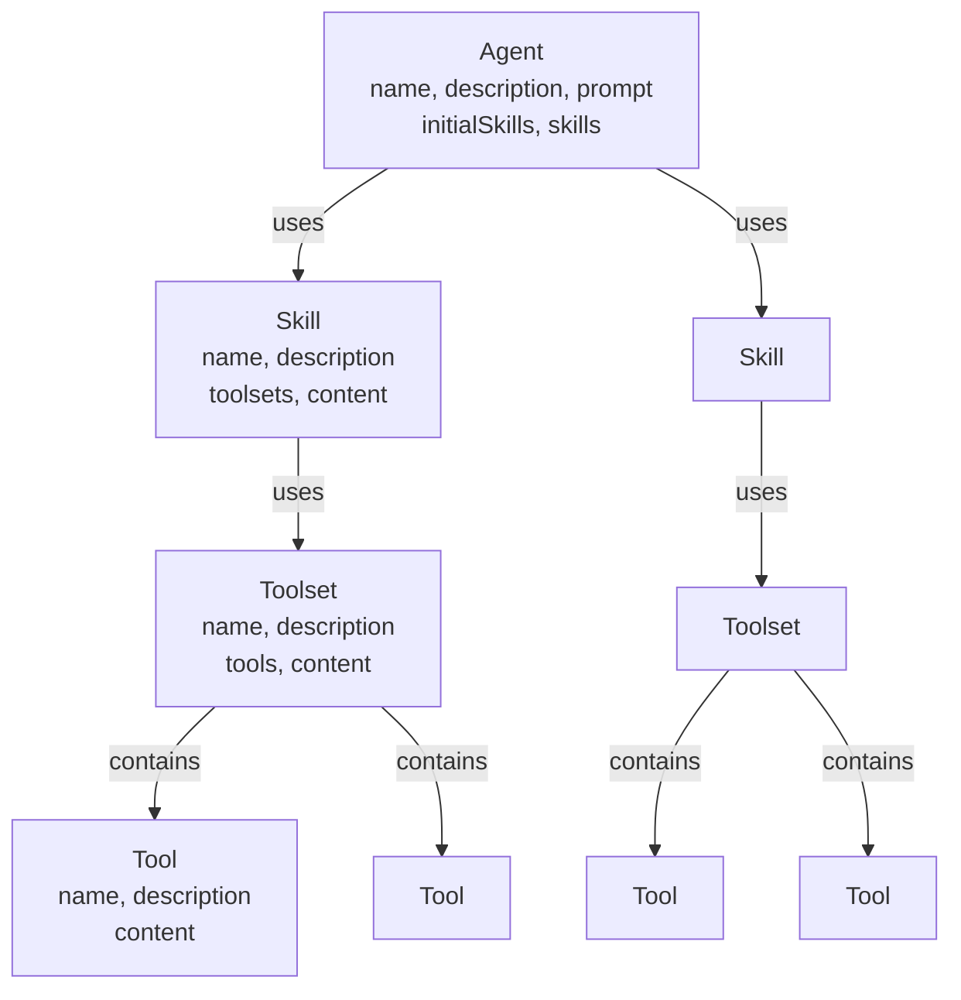

# Core Concepts

Understanding Carnet's core concepts will help you organize your AI agents effectively.

## The Four Entity Types

Carnet defines a hierarchy of four entity types that compose your agents:

## Two Types of Tools

With the introduction of executable tools, it's important to distinguish between two types of tools in the Carnet ecosystem:

### Carnet Meta‑Tools 🔍

Carnet provides a small set of meta‑tools to support progressive discovery of skills and content. These are intentionally minimal:

- `listAvailableSkills`
- `loadSkill`

These meta‑tools are provided alongside your domain tools (from toolsets). Meta‑tools are used to manage discovery and session state; domain tools provide executable capabilities.

### Domain Tools 🛠️

These are the actual, executable tools that you, the developer, provide. They represent the concrete capabilities of your application (e.g., `searchDatabase`, `generateImage`, `sendEmail`).

- **Dynamically Exposed:** They are not available to the agent initially. They are automatically exposed when the agent loads a `Skill` that is associated with the tool's `Toolset`.
- **Executable:** When the agent calls a domain tool, your provided `execute` function is run.

```
Agent
├── Skills (on-demand)
│   └── Toolsets
│       └── Tools
└── Skills (auto-loaded)
    └── Toolsets
        └── Tools
```

### Agent

An **Agent** is an AI assistant with a specific purpose and set of available skills.

**Key attributes:**
- `name` (frontmatter) - Unique identifier
- `description` (frontmatter) - What the agent does
- `initialSkills` (frontmatter) - Skills auto-loaded for every interaction
- `skills` (frontmatter) - Skills available on-demand
- `prompt` (markdown body) - The system prompt for the agent

**Example use case:** A "coder" agent for code generation tasks.

### Skill

A **Skill** is a capability that groups related tools and provides documentation.

**Key attributes:**
- `name` (frontmatter) - Unique identifier
- `description` (frontmatter) - What the skill enables
- `toolsets` (frontmatter) - Collections of tools used by this skill
- `content` (markdown body) - Documentation for the skill

**Example:** A "code-generation" skill that uses code formatting and analysis tools.

**Key insight:** Skills allow agents to access tools on-demand without loading everything at once.

### Toolset

A **Toolset** is a collection of related tools for a specific domain.

**Key attributes:**
- `name` (frontmatter) - Unique identifier
- `description` (frontmatter) - Domain or purpose
- `tools` (frontmatter) - Individual tools in this collection
- `content` (markdown body) - Documentation for the toolset

**Example:** A "code-formatter" toolset containing formatting and linting tools.

### Tool

A **Tool** is the smallest atomic unit - a single capability or function.

**Key attributes:**
- `name` (frontmatter) - Unique identifier
- `description` (frontmatter) - What the tool does
- `content` (markdown body) - How to use it

**Example:** A "prettier" tool for code formatting.

## Initial vs On-Demand Skills

### Initial Skills

Skills listed in `initialSkills` are **automatically loaded** for every agent interaction.

Use for:
- Skills needed frequently
- Core capabilities essential to the agent
- Keep this list small for performance

```yaml
initialSkills:
  - code-execution
```

### On-Demand Skills

Skills listed in `skills` are **loaded when needed**.

Use for:
- Less frequently used capabilities
- Optional features
- Specialized domain knowledge
- Can be extensive

```yaml
skills:
  - code-generation
  - debugging
  - documentation
  - testing
```

## Global vs Agent-Specific Configuration

### Global Configuration

Skills can be made available to all agents through global configuration:

```json
{
  "app": {
    "globalSkills": ["utilities", "common"]
  }
}
```

Use for:
- Cross-cutting capabilities
- Shared helper skills
- Standard libraries

### Agent-Specific Configuration

Each agent can define its own skills:

```yaml
skills:
  - specialized-skill-1
  - specialized-skill-2
```

Use for:
- Agent-specific expertise
- Domain-focused tools
- Custom configurations

## File Organization & More

For detailed information on file organization, naming conventions, and the build process, see the [Configuration](/configuration/) section which covers:
- [Content Structure](/configuration/content-structure/agents.md) - File layout and organization
- [Configuration Files](/configuration/config-file.md) - carnet.config.json setup
- [Manifest Schema](/configuration/manifest-schema.md) - Generated output format

## Key Design Principles

### Composition Over Inheritance

Build agents by composing existing skills and tools rather than duplicating functionality.

### Declarative Configuration

Define what your agents can do with YAML frontmatter, not code.

### Build-Time Validation

All references are validated when you build, catching errors early.

### Zero Runtime Parsing

The compiled manifest loads instantly - no parsing overhead.

### Version Control Friendly

Everything is markdown, making it perfect for git and version control.

## Architecture Diagram



## Best Practices

1. **Keep initial skills lean** - Auto-loaded skills should be essential only
2. **Organize tools by domain** - Use toolsets to group related tools
3. **Document everything** - Use the content field for clear descriptions
4. **Use meaningful names** - Descriptive entity names improve clarity
5. **Reference existing entities** - Build new agents from existing skills/tools

